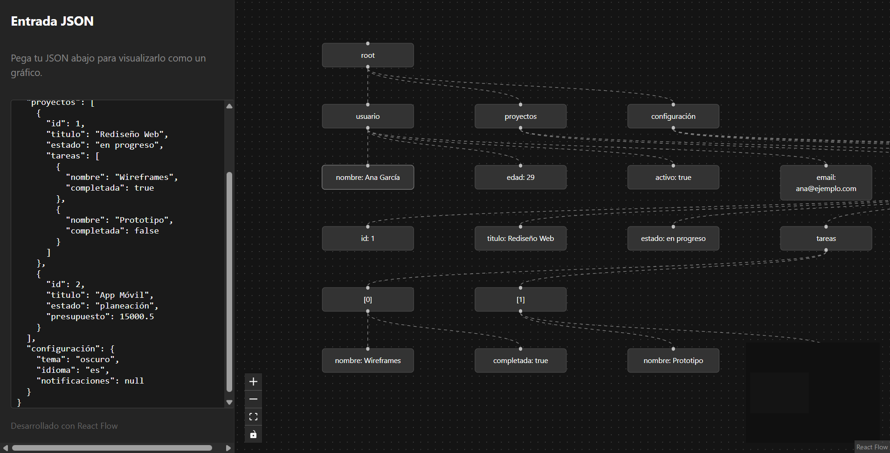

# JSON Visualizer with React Flow

Una aplicación de React que permite interpretar archivos JSON y mostrarlos gráficamente usando React Flow.



## Características

- **Visualización de JSON**: Transforma estructuras JSON complejas en diagramas de flujo interactivos.
- **Sidebar Interactivo**: Permite pegar o editar JSON directamente y ver los cambios en tiempo real.
- **Tema Oscuro (Dark Mode)**: Interfaz diseñada para reducir la fatiga visual con un estilo moderno.
- **Navegación Fluida**: Zoom, paneo y minimapa integrados gracias a React Flow.

## Detalles Técnicos

### Tecnologías Utilizadas

- **React 19**: Biblioteca principal para la interfaz de usuario.
- **TypeScript**: Para un desarrollo robusto con tipado estático.
- **Vite**: Herramienta de construcción ultra rápida.
- **@xyflow/react (React Flow)**: Para la renderización de los gráficos y diagramas.
- **CSS3**: Estilos personalizados para el layout y el tema oscuro.

### Arquitectura

1. **`src/App.tsx`**: Componente principal que gestiona el estado del JSON y coordina la actualización del gráfico.
2. **`src/components/Sidebar.tsx`**: Contenedor lateral para la entrada de datos JSON.
3. **`src/components/FlowCanvas.tsx`**: Envoltorio de React Flow que renderiza los nodos y aristas.
4. **`src/utils/jsonParser.ts`**: Lógica central que recorre recursivamente el objeto JSON para generar la estructura de `nodes` y `edges` compatible con React Flow.

## Cómo empezar

1. Instala las dependencias:
   ```bash
   npm install
   ```

2. Inicia el servidor de desarrollo:
   ```bash
   npm run dev
   ```

3. Abre el navegador en `http://localhost:5173`.

## Especificaciones de Interpretación

El parser actual:
- Identifica objetos y arreglos como nodos interconectados.
- Muestra valores primitivos (strings, numbers, booleans) como nodos finales.
- Genera automáticamente un layout vertical básico para facilitar la lectura inicial.
